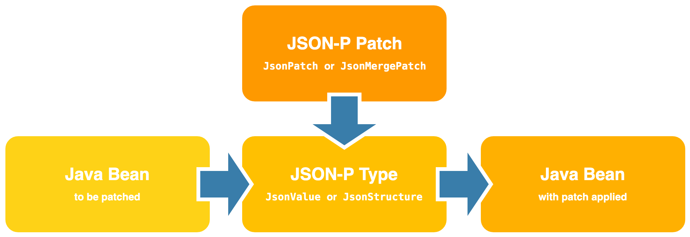

# Using HTTP `PATCH` 

This project demonstrates an approach to support HTTP `PATCH` with _JSON Patch_ and _JSON Merge Patch_ for performing partial modifications to resources in Spring, as described in my [blog][blog.post]. I also have put together a [Postman collection][repo.postman] so you can play around with the API.

As I have seen lots of misunderstanding on how `PATCH` works, I aim to clarify its usage before diving into the actual solution.

##### Table of Contents  
- [The problem with `PUT` and the need for `PATCH`](#the-problem-with-put-and-the-need-for-patch)  
- [Describing how the resource will be modified](#describing-how-the-resource-will-be-modified)
  - [JSON Patch](#json-patch)
  - [JSON Merge Patch](#json-merge-patch)
- [JSON-P: Java API for JSON Processing](#json-p-java-api-for-json-processing)
- [Parsing the request payload](#parsing-the-request-payload)
- [Creating the controller methods](#creating-the-controller-methods)
- [Applying the patch](#applying-the-patch)
- [Validating the patch](#validating-the-patch)
- [Bonus: Decoupling the domain model from the API model](#bonus-decoupling-the-domain-model-from-the-api-model)
- [References](#references)

## The problem with `PUT` and the need for `PATCH`

Consider, for example, we are creating an API to manage contacts. On the server, we have a resource that can be represented with the following JSON document:

```json
{
  "id": 1,
  "name": "John Appleseed",
  "work": {
    "title": "Engineer",
    "company": "Acme"
  },
  "phones": [
    {
      "phone": "0000000000",
      "type": "mobile"
    }
  ]
}
```

Let's say that John has been promoted to senior engineer and we want to keep our contact list updated. We could modify this resource using a `PUT` request, as shown below:

```http
PUT /contacts/1 HTTP/1.1
Host: example.org
Content-Type: application/json

{
  "id": 1,
  "name": "John Appleseed",
  "work": {
    "title": "Senior Engineer",
    "company": "Acme"
  },
  "phones": [
    {
      "phone": "0000000000",
      "type": "mobile"
    }
  ]
}
```

With `PUT`, however, we have to send the full representation of the resource even when we need to modify a _single_ field of a resource, which may not be desirable in some situations.

Let's have a look on how the `PUT` HTTP method is defined in the [RFC 7231][rfc7231], one of the documents that currently define the HTTP/1.1 protocol:

>[**4.3.4.  PUT**][rfc7231.put]
>
>The `PUT` method requests that the state of the target resource be created or replaced with the state defined by the representation enclosed in the request message payload. [...]

So, as per definition, the `PUT` method is meant to be used for:

- _Creating_ resources <sup name="a1">[[1]](#f1)</sup>
- _Replacing_ the state of a given resource

The key here is: the `PUT` payload must be a _new representation of the resource_. Hence it's not meant for performing _partial modifications_ to resources at all. To fill this gap, the `PATCH` method was created and it is currently defined in the [RFC 5789][rfc5789]:

> [**2. The PATCH Method**][rfc5789.patch]
>
>The `PATCH` method requests that a set of changes described in the request entity be applied to the resource identified by the Request-URI. The set of changes is represented in a format called a "patch document" identified by a media type. [...]

The difference between the `PUT` and `PATCH` requests is reflected in the way the server processes the request payload to modify a given resource:

- In a `PUT` request, the payload is a modified version of the resource stored on the server. And the client is requesting the stored version to be _replaced_ with the new version.
- In a `PATCH` request, the request payload contains a _set of instructions_ describing how a resource currently stored on the server should be modified to produce a new version.

## Describing how the resource will be modified

The `PATCH` method definition, however, doesn't enforce any format for the request payload apart from mentioning that the request payload should contain a set of instructions describing how the resource will be modified and that set of instructions is identified by a media type.

Let's have a look at some formats for describing how a resource is to be `PATCH`ed:

### JSON Patch

JSON Patch is a format for expressing a sequence of operations to be applied to a JSON document. It is defined in the [RFC 6902][rfc6902] and is identified by the `application/json-patch+json` media type.

The JSON Patch document represents an array of objects and each object represents a single operation to be applied to the target JSON document. 

The evaluation of a JSON Patch document begins against a target JSON document and the operations are applied sequentially in the order they appear in the array. Each operation in the sequence is applied to the target document and the resulting document becomes the target of the next operation. The evaluation continues until all operations are successfully applied or until an error condition is encountered.

The operation objects must have exactly one `op` member, whose value indicates the operation to perform:

| Operation | Description |
| --------- | ----------- |
| [`add`][rfc6902.add] | Adds the value at the target location; if the value exists in the given location, it's replaced |
| [`remove`][rfc6902.remove] | Removes the value at the target location |
| [`replace`][rfc6902.replace] | Replaces the value at the target location |
| [`move`][rfc6902.move] | Removes the value at a specified location and adds it to the target location |
| [`copy`][rfc6902.copy] | Copies the value at a specified location to the target location |
| [`test`][rfc6902.test] | Tests that a value at the target location is equal to a specified value |

Any other values are considered errors.

A request to modify John's job title could be:

```http
PATCH /contacts/1 HTTP/1.1
Host: example.org
Content-Type: application/json-patch+json

[
  { "op": "replace", "path": "/work/title", "value": "Senior Engineer" }
]
```

### JSON Merge Patch

JSON Merge Patch is a format that describes the changes to be made to a target JSON document using a syntax that closely mimics the document being modified. It is defined in the [RFC 7396][rfc7396] is identified by the `application/merge-patch+json` media type.

The server processing a JSON Merge Patch document determine the exact set of changes being requested by comparing the content of the provided patch against the current content of the target document: 

- If the merge patch contains members that do not appear within the target document, those members are _added_
- If the target does contain the member, the value is _replaced_
- _null_ values in the merge patch indicate that existing values in the target document are to be _removed_
- Other values in the target document will remain _untouched_

A request to modify John's job title could be:

```http
PATCH /contacts/1 HTTP/1.1
Host: example.org
Content-Type: application/merge-patch+json

{
  "work": {
    "title": "Senior Engineer"
  }
}
```

## JSON-P: Java API for JSON Processing

_JSON-P_ 1.0, defined in the JSR 353 and also known as _Java API for JSON Processing_ 1.0, brought official support for JSON processing in Java EE. JSON-P 1.1, defined in the JSR 374, introduced support for JSON Patch and JSON Merge Patch formats to Java EE.

Let's have a quick look at the API to start getting familiar with it: 

| Type | Description |
| ---- | ----------- |
| [`Json`][javax.json.Json] | Factory class for creating JSON processing objects |
| [`JsonPatch`][javax.json.JsonPatch] | Represents an implementation of JSON Patch |
| [`JsonMergePatch`][javax.json.JsonMergePatch] | Represents an implementation of JSON Merge Patch |
| [`JsonValue`][javax.json.JsonValue] | Represents an immutable JSON value that can be an [_object_][javax.json.JsonObject], an [_array_][javax.json.JsonArray], a [_number_][javax.json.JsonNumber], a [_string_][javax.json.JsonString], [_`true`_][javax.json.JsonValue.TRUE], [_`false`_][javax.json.JsonValue.FALSE] or [_`null`_][javax.json.JsonValue.NULL] |
| [`JsonStructure`][javax.json.JsonStructure] | Super type for the two structured types in JSON: [_object_][javax.json.JsonObject] and [_array_][javax.json.JsonArray] |

To patch using JSON Patch, we would have the following: 

```java
// Target JSON document to be patched
JsonObject target = ...;

// Create JSON Patch document
JsonPatch jsonPatch = Json.createPatchBuilder()
        .replace("/work/title", "Senior Engineer")
        .build();

// Apply the patch to the target document
JsonValue patched = jsonPatch.apply(target);
```

And to patch using JSON Merge Patch, we would have the following:

```java
// Target JSON document to be patched
JsonObject target = ...;

// Create JSON Merge Patch document
JsonMergePatch mergePatch = Json.createMergePatch(Json.createObjectBuilder()
        .add("work", Json.createObjectBuilder()
                .add("title", "Senior Engineer"))
        .build());

// Apply the patch to the target document
JsonValue patched = mergePatch.apply(target);
```

Having said that, let me highlight that JSON-P is just an API, that is, a set of interfaces. If we want to work with it, we need an _implementation_ such as [Apache Johnzon][johnzon]: 

```xml
<dependency>
    <groupId>org.apache.johnzon</groupId>
    <artifactId>johnzon-core</artifactId>
    <version>${johnzon.version}</version>
</dependency>
```

## Parsing the request payload

To parse a `PATCH` request payload, we must take the following into account:

- For an incoming request with the `application/json-patch+json` content type, the payload must be converted to an instance of [`JsonPatch`][javax.json.JsonPatch].
- For an incoming request with the `application/merge-patch+json` content type, the payload must be converted to an instance of [`JsonMergePatch`][javax.json.JsonMergePatch].

Spring MVC, however, doesn't know how to create instances of [`JsonPatch`][javax.json.JsonPatch] and [`JsonMergePatch`][javax.json.JsonMergePatch]. So we need to provide a custom [`HttpMessageConverter<T>`][org.springframework.http.converter.HttpMessageConverter] for each type. Fortunately it's pretty straightforward.

For convenience, let's extend [`AbstractHttpMessageConverter<T>`][org.springframework.http.converter.AbstractHttpMessageConverter] and annotate the implementation with [`@Component`][org.springframework.stereotype.Component], so Spring can pick it up:

```java
@Component
public class JsonPatchHttpMessageConverter extends AbstractHttpMessageConverter<JsonPatch> {
   ...
}
```

The constructor will invoke the parent's constructor indicating the supported media type for this converter:

```java
public JsonPatchHttpMessageConverter() {
    super(MediaType.valueOf("application/json-patch+json"));
}
```

We indicate that our converter supports the [`JsonPatch`][javax.json.JsonPatch] class:

```java
@Override
protected boolean supports(Class<?> clazz) {
    return JsonPatch.class.isAssignableFrom(clazz);
}
```

Then we implement the method that will read the HTTP request payload and convert it to a [`JsonPatch`][javax.json.JsonPatch] instance:

```java
@Override
protected JsonPatch readInternal(Class<? extends JsonPatch> clazz, HttpInputMessage inputMessage)
        throws HttpMessageNotReadableException {

    try (JsonReader reader = Json.createReader(inputMessage.getBody())) {
        return Json.createPatch(reader.readArray());
    } catch (Exception e) {
        throw new HttpMessageNotReadableException(e.getMessage(), inputMessage);
    }
}
```

It's unlikely we'll need to write [`JsonPatch`][javax.json.JsonPatch] instances to the responses, but we could implement it as follows:

```java
@Override
protected void writeInternal(JsonPatch jsonPatch, HttpOutputMessage outputMessage)
        throws HttpMessageNotWritableException {

    try (JsonWriter writer = Json.createWriter(outputMessage.getBody())) {
        writer.write(jsonPatch.toJsonArray());
    } catch (Exception e) {
        throw new HttpMessageNotWritableException(e.getMessage(), e);
    }
}
```

The message converter for [`JsonMergePatch`][javax.json.JsonMergePatch] is pretty much the same as the converter described above (except for the types handled by the converter):

```java
@Component
public class JsonMergePatchHttpMessageConverter extends AbstractHttpMessageConverter<JsonMergePatch> {

    public JsonMergePatchHttpMessageConverter() {
        super(MediaType.valueOf("application/merge-patch+json"));
    }

    @Override
    protected boolean supports(Class<?> clazz) {
        return JsonMergePatch.class.isAssignableFrom(clazz);
    }

    @Override
    protected JsonMergePatch readInternal(Class<? extends JsonMergePatch> clazz, HttpInputMessage inputMessage)
            throws HttpMessageNotReadableException {

        try (JsonReader reader = Json.createReader(inputMessage.getBody())) {
            return Json.createMergePatch(reader.readValue());
        } catch (Exception e) {
            throw new HttpMessageNotReadableException(e.getMessage(), inputMessage);
        }
    }

    @Override
    protected void writeInternal(JsonMergePatch jsonMergePatch, HttpOutputMessage outputMessage)
            throws HttpMessageNotWritableException {

        try (JsonWriter writer = Json.createWriter(outputMessage.getBody())) {
            writer.write(jsonMergePatch.toJsonValue());
        } catch (Exception e) {
            throw new HttpMessageNotWritableException(e.getMessage(), e);
        }
    }
}
```

## Creating the controller methods

With the HTTP message converters in place, we can receive [`JsonPatch`][javax.json.JsonPatch] and [`JsonMergePatch`][javax.json.JsonMergePatch] as method arguments in our controller methods, annotated with [`@RequestBody`][org.springframework.web.bind.annotation.RequestBody]:

```java
@PatchMapping(path = "/{id}", consumes = "application/json-patch+json")
public ResponseEntity<Void> updateContact(@PathVariable Long id,
                                          @RequestBody JsonPatch patchDocument) {
    ...
}
```

```java
@PatchMapping(path = "/{id}", consumes = "application/merge-patch+json")
public ResponseEntity<Void> updateContact(@PathVariable Long id,
                                          @RequestBody JsonMergePatch mergePatchDocument) {
    ...
}
```

## Applying the patch

It is worth it to mention that both JSON Patch and JSON Merge Patch operate over JSON documents. 

So, to apply the patch to a Java bean, we first need to convert the Java bean to a JSON-P type, such as [`JsonStructure`][javax.json.JsonStructure] or [`JsonValue`][javax.json.JsonValue]. Then we apply the patch to it and convert the patched document back to a Java bean:

<!-- Hack to center the image in GitHub -->
<p align="center">
  
</p>

These conversions could be handled by Jackson, which provides an [extension module][jackson-datatype-jsr353] to work with JSON-P types. With this extension module, we can read JSON as [`JsonValue`][javax.json.JsonValue]s and write [`JsonValue`][javax.json.JsonValue]s as JSON as part of normal Jackson processing, taking advantage of the powerful data-binding features that Jackson provides:

```xml
<dependency>
    <groupId>com.fasterxml.jackson.datatype</groupId>
    <artifactId>jackson-datatype-jsr353</artifactId>
    <version>${jackson.version}</version>
</dependency>
```

With module extension dependency on the classpath, we can configure the [`ObjectMapper`][com.fasterxml.jackson.databind.ObjectMapper] and expose it as a Spring [`@Bean`][org.springframework.context.annotation.Bean] (so it can be picked up by String and can be injected in other Spring beans):  

```java
@Bean
public ObjectMapper objectMapper() {
    return new ObjectMapper()
            .setDefaultPropertyInclusion(Include.NON_NULL)
            .disable(DeserializationFeature.FAIL_ON_UNKNOWN_PROPERTIES)
            .disable(SerializationFeature.WRITE_DATES_AS_TIMESTAMPS)
            .findAndRegisterModules();
}
```

The [`findAndRegisterModules()`][com.fasterxml.jackson.databind.ObjectMapper.findAndRegisterModules] method is important here: it tells Jackson to search and register the any modules found in the classpath, including the [`jackson-datatype-jsr353`][jackson-datatype-jsr353] extension module. Alternatively, we can register the module manually: 

```java
mapper.registerModule(new JSR353Module());
```

Once the [`ObjectMapper`][com.fasterxml.jackson.databind.ObjectMapper] is configured, we can inject it in our Spring beans and create a method to apply the JSON Patch to a Java bean:

```java
public <T> T patch(JsonPatch patch, T targetBean, Class<T> beanClass) {
    
    // Convert the Java bean to a JSON document
    JsonStructure target = mapper.convertValue(targetBean, JsonStructure.class);
    
    // Apply the JSON Patch to the JSON document
    JsonValue patched = patch.apply(target);
    
    // Convert the JSON document to a Java bean and return it
    return mapper.convertValue(patched, beanClass);
}
```

And here's the method to patch using JSON Merge Patch:

```java
public <T> T mergePatch(JsonMergePatch mergePatch, T targetBean, Class<T> beanClass) {
    
    // Convert the Java bean to a JSON document
    JsonValue target = mapper.convertValue(targetBean, JsonValue.class);
    
    // Apply the JSON Merge Patch to the JSON document
    JsonValue patched = mergePatch.apply(target);
    
    // Convert the JSON document to a Java bean and return it
    return mapper.convertValue(patched, beanClass);
}
```

With this in place, the controller method implementation for JSON Patch could be like:

```java
@PatchMapping(path = "/{id}", consumes = "application/json-patch+json")
public ResponseEntity<Void> updateContact(@PathVariable Long id,
                                          @RequestBody JsonPatch patchDocument) {

    // Find the model that will be patched
    Contact contact = contactService.findContact(id).orElseThrow(ResourceNotFoundException::new);
    
    // Apply the patch
    Contact contactPatched = patch(patchDocument, contact, Contact.class);
    
    // Persist the changes
    contactService.updateContact(contactPatched);

    // Return 204 to indicate the request has succeeded
    return ResponseEntity.noContent().build();
}
```

And the implementation is quite similar for JSON Merge Patch, except for the media type and for the types handled by the method:

```java
@PatchMapping(path = "/{id}", consumes = "application/merge-patch+json")
public ResponseEntity<Void> updateContact(@PathVariable Long id,
                                          @RequestBody JsonMergePatch mergePatchDocument) {

    // Find the model that will be patched
    Contact contact = contactService.findContact(id).orElseThrow(ResourceNotFoundException::new);
    
    // Apply the patch
    Contact contactPatched = mergePatch(mergePatchDocument, contact, Contact.class);
    
    // Persist the changes
    contactService.updateContact(contactPatched);

    // Return 204 to indicate the request has succeeded
    return ResponseEntity.noContent().build();
}
```

## Validating the patch

Once the patch has been applied and before persisting the changes, we must ensure that the patch didn't lead the resource to an _invalid_ state. We could use [Bean Validation annotations][javax.validation.constraints] to define constraints and then ensure that the state of the model is valid. 

```java
public class Contact {

    @NotBlank
    private String name;
    
    ...
}
```

To perform the validation, we could inject [`Validator`][javax.validation.Validator] in our class and invoke the [`validate()`][javax.validation.Validator.validate] method. If any constraint has been violated, it will return a set of [`ConstraintViolation<T>`][javax.validation.ConstraintViolation] and then we can throw a [`ConstraintViolationException`][javax.validation.ConstraintViolationException]. So the method to apply the patch could be updated to handle the validation, as shown below:

```java
public <T> T patch(JsonPatch patch, T targetBean, Class<T> beanClass) {
    
    // Convert the Java bean to a JSON document
    JsonStructure target = mapper.convertValue(targetBean, JsonStructure.class);
    
    // Apply the JSON Patch to the JSON document
    JsonValue patched = applyPatch(patch, target);

    // Convert the JSON document to a Java bean
    T beanPatched = mapper.convertValue(patched, beanClass);

    // Validate the Java bean and throw an excetion if any constraint has been violated
    Set<ConstraintViolation<T>> violations = validator.validate(beanPatched);
    if (!violations.isEmpty()) {
        throw new ConstraintViolationException(violations);
    }

    // Return the bean that has been patched
    return beanPatched;
}
```

Alternatively, we could simply annotate the method with [`@Valid`][javax.validation.Valid] and Bean Validation will take care of performing the the validation on the returned value (the Spring bean may need to be annotated with [`@Validated`][org.springframework.validation.annotation.Validated] to trigger the validation):

```java
@Valid
public <T> T patch(JsonPatch patch, T targetBean, Class<T> beanClass) {
    
    // Convert the Java bean to a JSON document
    JsonStructure target = mapper.convertValue(targetBean, JsonStructure.class);
    
    // Apply the JSON Patch to the JSON document
    JsonValue patched = applyPatch(patch, target);

    // Convert the JSON document to a Java bean and return it
    return mapper.convertValue(patched, beanClass);
}
```

## Bonus: Decoupling the domain model from the API model

The models that represent the _domain_ of our application and the models that represent the _data handled by our API_ are (or at least should be) _different concerns_ and should be _decoupled_ from each other. We don't want to break our API clients when we add, remove or rename a field from the application domain model.<sup name="a2">[[2]](#f2)</sup> 

While our service layer operates over the domain/persistence models, our API controllers should operate over a different set of models. As our domain/persistence models evolve to support new business requirements, for example, we may want to create new versions of the API models to support these changes. We also may want to deprecate the old versions of our API as new versions are released. And it's perfectly possible to achieve when the things are _decoupled_.

To minimize the boilerplate code of converting the domain model to the API model (and vice versa), we could rely on frameworks such as [MapStruct][mapstruct]. And we also could consider using [Lombok][lombok] to generate getters, setters, `equals()`, `hashcode()` and `toString()` methods for us.
 
By decoupling the API model from domain model, we also can ensure that we expose only the fields that can be modified. For example, we don't want to allow the client to modify the `id` field of our domain model. So our API model shouldn't contain the `id` field (and any attempt to modify it may cause an error or may be ignored).

In this example, the domain model class is called `Contact` and the model class that represents a resource is called `ContactResourceInput`. To convert between these two models with MapStruct, we could define a mapper interface and MapStruct will generate an implementation for it:

```java
@Mapper(componentModel = "spring")
public interface ContactMapper {

    ContactResourceInput asContactResourceInput(Contact contact);

    void update(ContactResourceInput contactResource, @MappingTarget Contact contact);
    
    ...
}
```  

The `ContactMapper` implementation will be exposed as a Spring [`@Component`][org.springframework.stereotype.Component], so it can be injected in other Spring beans. Let me highlight that _MapStruct doesn't use reflections_. Instead, it creates an actual implementation for the mapper interface and we can even check the code if we want to.

Once the `ContactMapper` is injected in our controller, we can use it to handle the model conversion. Here's what the controller method for handling `PATCH` requests with JSON Patch could be like:

```java
@PatchMapping(path = "/{id}", consumes = "application/json-patch+json")
public ResponseEntity<Void> updateContact(@PathVariable Long id,
                                          @RequestBody JsonPatch patchDocument) {

    // Find the domain model that will be patched
    Contact contact = contactService.findContact(id).orElseThrow(ResourceNotFoundException::new);
    
    // Map the domain model to an API resource model
    ContactResourceInput contactResource = contactMapper.asContactResourceInput(contact);
    
    // Apply the patch to the API resource model
    ContactResourceInput contactResourcePatched = patch(patchDocument, contactResource, ContactResourceInput.class);

     // Update the domain model with the details from the API resource model
    contactMapper.update(contactResourcePatched, contact);
    
    // Persist the changes
    contactService.updateContact(contact);

    // Return 204 to indicate the request has succeeded
    return ResponseEntity.noContent().build();
}
```

And, for comparision purposes, here's a controller method for handling `PUT` requests:

```java
@PutMapping(path = "/{id}", consumes = "application/json")
public ResponseEntity<Void> updateContact(@PathVariable Long id,
                                          @RequestBody @Valid ContactResourceInput contactResource) {

    // Find the domain model that will be updated
    Contact contact = contactService.findContact(id).orElseThrow(ResourceNotFoundException::new);
    
    // Update the domain model with the details from the API resource model
    contactMapper.update(contactResource, contact);
    
    // Persist the changes
    contactService.updateContact(contact);

    // Return 204 to indicate the request has succeeded
    return ResponseEntity.noContent().build();
}
```

## References

- [RFC 7231][rfc7231]: Semantics and content for the HTTP/1.1 protocol
- [RFC 5789][rfc5789]: HTTP `PATCH` method
- [RFC 6902][rfc6902]: JSON Patch
- [RFC 7396][rfc7396]: JSON Merge Patch
- [`javax.json`][javax.json]: Java API for JSON processing

---

